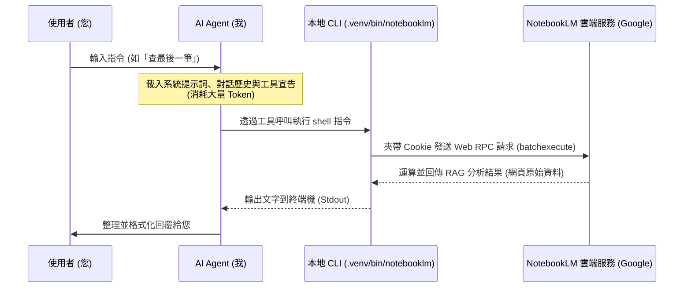
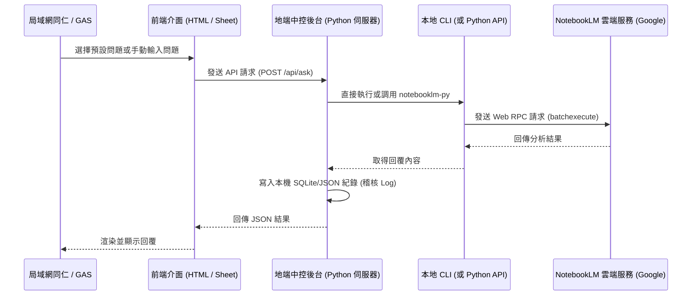

# NotebookLM 中控平台架構與 Token 消耗分析

本文件說明現行透過 Agent 操作的運作機制，並詳細分析若將其改建為**「地端中控平台（Web Portal / GAS）」**後的運作流程與 AI Token 消耗估算。

---

## 1. 現行機制 vs. 中控平台機制運作比較

### A. 現行機制（透過 AI Agent 代理操作）
當您在對話框中請我（Agent）去查詢或測試時，背後的運作流程如下：

### B. 未來中控平台機制（地端網頁 / GAS 直連）
若我們開發了中控平台（例如在 Tab 9 新增「中控問答」或透過 Google Sheets 點擊按鈕）：

---

## 2. Token 消耗與費用分析

### A. 現行 Agent 機制（極為昂貴）
每次您在 Chat 中與我對話，底層運作是基於 **Gemini 1.5 Pro API**。
* **Input Token（輸入消耗）**：每次發問都需要將「我所有的 Tool 定義（數十個工具描述）」、「數千字的系統 prompt」、「漫長的歷史對話紀錄」打包送給 Gemini 模型。單次發問的 Input Token 大約在 **10,000 ~ 25,000+ Tokens**，且隨對話增長而遞增。
* **Output Token（輸出消耗）**：我思考後產生的 tool 呼叫與文字回覆，約 **500 ~ 2,000 Tokens**。
* **費用**：如果使用付費 API，這需要支付 API 額度。

### B. 中控平台直連機制（完全免費！$0 Token 費）
當我們繞過 Agent，讓地端 Python 伺服器直接以 `notebooklm-py` 與 Google 對接時：
* **API Token 消耗：0 點（免費）**。
* **原因**：`notebooklm-py` 是透過模擬瀏覽器登入（使用「最強帳號」的 Cookie）來存取 Google 的 NotebookLM 服務。
* **費用解析**：
  - Google 目前提供的 NotebookLM 網頁端服務是**免費**的（由 Google 端的伺服器吸收了 Gemini 1.5 Pro 的 RAG 運算成本）。
  - 我們直接對接它的 RPC 接口，因此您的**私有 Gemini API Key 完全不需要被調用**，不會產生任何 API 帳單費用。
  - 對於地端伺服器來說，只消耗了微量的網路頻寬與 CPU 運算（執行一個 Python 指令）。

---

## 3. 中控平台的設計方案與運作細節

若要實作「預選問題」或「手動輸入」，其具體運作如下：

| 功能項目 | 預選問題 (Pre-selected) | 手動輸入問題 (Manual Input) |
| :--- | :--- | :--- |
| **介面設計** | 下拉選單（例如：「列出行政痛點」、「統計各階段數量」、「高風險警告項目」） | 自由文本輸入框 |
| **後端邏輯** | 伺服器端寫死對應的優化 Prompt（例如選擇「列出行政痛點」時，後台自動發送：*`請列出所有問題類別屬於『行政與核銷/文宣』的項目...`*） | 後端直接將使用者輸入的字串發送給 CLI |
| **處理時效** | 約 **5 ~ 8 秒**（依網路速度與 Google RAG 響應時間而定） | 約 **5 ~ 8 秒** |
| **稽核日誌** | 紀錄：`時間`, `發問者IP/姓名`, `預選項目`, `NotebookLM回覆` | 紀錄：`時間`, `發問者IP/姓名`, `自訂問題`, `NotebookLM回覆` |
| **Token 成本** | **$0** (Google 負擔) | **$0** (Google 負擔) |

---

## 4. 結論

1. **極度推薦改建為中控平台**：這樣做可以徹底擺脫 Agent 框架的超高 Token 負擔，實現 **$0 運算成本** 的無限次查詢。
2. **多用戶安全性**：伺服器統一管理「最強帳號」的 Cookie，使用者（同仁）觸碰不到帳號密碼與 Cookie，只會看到乾淨的介面，保障帳號安全。
3. **擴充潛力**：中控平台除了提供 HTML 網頁外，還可以直接提供 API 給 Google Apps Script (GAS)，讓同仁在 Google 試算表內一鍵點擊便完成上傳與分析。
