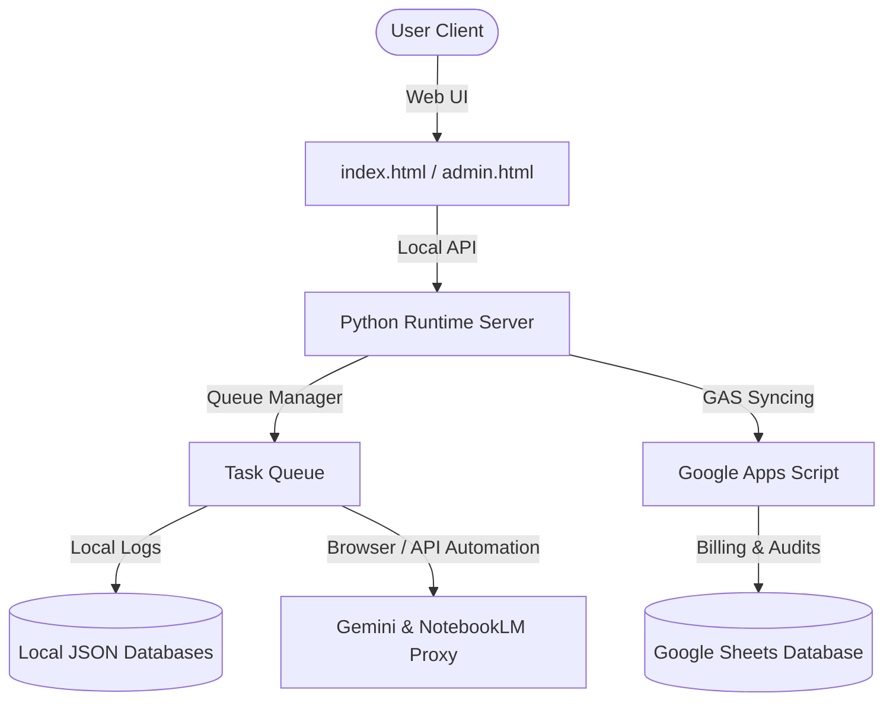

# AI NotebookLM Local Gateway - Project Development Chronicle (v1.0 - v2.11)

This chronicle acts as a structured repository of the system's evolution, technical blueprints, design decisions, and milestones.

---

## 1. System Overview & Architecture

The **AI NotebookLM Local Gateway** is a local-first proxy and automation worker designed to bridge team workflows with **Google NotebookLM** and **Gemini Advanced Web**. It features local file preprocessing (ETL), task queueing, local history caching, and audit governance, with optional cloud syncing through **Google Apps Script (GAS)** to a centralized Google Sheet.



### Core Architecture Components
*   **Web Portal**: A glassmorphic, themeable interface supporting **NotebookLM Multi-turn Chat**, **Gemini Advanced Proxy**, **ETL Conversions**, and **Remarks History**.
*   **Admin Console (`admin.html`)**: A separated secure panel for monitoring audit logs and configuring GAS settings.
*   **Python Runtime**: A backend handling requests, queueing, session persistence, and serving static assets.
*   **GAS Integration**: A bridge syncing local interactions with Google Sheets for cross-team auditing and token usage calculations.

---

## 2. Version Evolution & Milestones

### 🚀 v1.0 - The Foundation
*   **Features**: Established the local-first runtime, simple upload tab, and CSV/Excel ETL normalizer.
*   **Goal**: Create an MVP for local document formatting and uploading before sending data to NotebookLM.

### 📈 v2.0 - v2.05: GAS Integration & Cloud Infrastructure
*   **Features**: Introduced Google Apps Script (GAS) synchronization, VPS deployment guide, and screen session daemon.
*   **Goal**: Support remote scheduling and cloud reporting, enabling multi-tenant status checks.

### 🎨 v2.06 - v2.10: Header Redesign & CSS Stretch Realignment
*   **Features**:
    - **Double Horizontal Header**: Separated connection URLs (LAN & Ngrok WAN) into a sleek first row with small copy/refresh buttons, placing navigation tabs and system controls on the second row.
    - **CSS Grid Realignment**: Solved the circular height dependency. Replaced `height: 100%` on container cards with `height: auto` coupled with `align-items: stretch` inside the grid, forcing perfect native vertical alignment of the sidebar and chat panels.
    - **Administrator Branding**: Renamed "開發者模式" to "管理者" and highlighted the button with a permanent pink style (`#ff69b4`).

### 🔑 v2.11: Standalone Admin Window & Centralized Remarks Portal
*   **Features**:
    - **Standalone Admin Page**: Moved audit logs and GAS configurations to `admin.html`, which opens in a new window/tab, keeping the main interface focused on user chat.
    - **Header Session ID Actions**: Added "📋 複製 ID" and "📝 備註" next to active session IDs.
    - **Centralized Remarks Portal**: A new "對話紀錄" tab to search sessions, copy IDs, edit remarks, and view chat transcripts inside a modal.
    - **Sidebar Remarks Tags**: Renders a custom `📝 備註內容` watermark below session titles in sidebars.

---

## 3. Key Technical Challenges & Solved Issues

### 3.1 CSS Grid Circular Height Dependency
*   **Problem**: In v2.09, forcing left and right panels to `height: 100%` caused them to fall back to natural content height because the parent grid container relied on `min-height: 100vh` rather than a fixed height. This left the sidebar card shorter than the chat area on initial render.
*   **Solution**: Changed both panels to `height: auto` and let CSS Grid's native `align-items: stretch` pull them down to match the height of the taller panel.

### 3.2 Secure Path Routing for Standalone Admin Panels
*   **Problem**: Splitting the admin panel into `admin.html` opened up potential security access loopholes if not correctly integrated into the server's authentication loop.
*   **Solution**: Registered `/admin.html` inside both the static serving path maps and the cookie authentication filters in `runtime_server.py`. Unauthenticated requests to `/admin.html` are redirected to the login gate prompt.

---

## 4. Database Schema Reference

### 4.1 Local Session Remarks (multichat_sessions.json / gemini_sessions.json)
```json
{
  "sessions": [
    {
      "conversation_id": "sess_12345678",
      "user_name": "Force Cheng",
      "last_query_at": "2026-06-14 18:00:00",
      "last_question": "如何進行專案對齊？",
      "remark": "專案對齊排版優化"
    }
  ]
}
```
