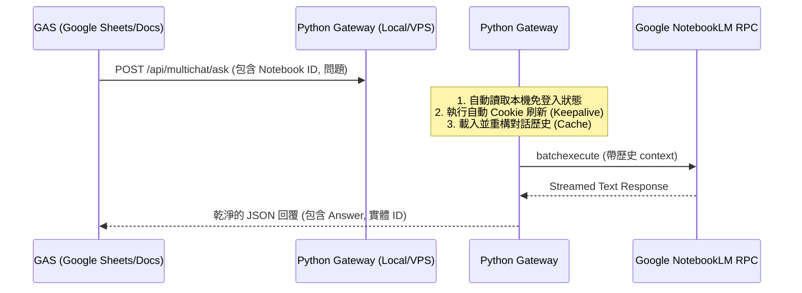

# Pure GAS vs. Hybrid Gateway Integration Analysis

本報告針對「是否能純靠 Google Apps Script (GAS) 呼叫同一個登入帳號來查詢 NotebookLM」進行可行性、挑戰與架構對比分析。

---

## 核心結論

> [!WARNING]
> **「純 GAS」在技術上是可行的，但在實際維護上極度困難且不穩定。**
> 主要阻礙在於 NotebookLM 沒有公開 API，必須模擬其內部的 `batchexecute` Web RPC 協議，且 **Google Auth 登入狀態（Cookies）存在極短的生命週期（如 `__Secure-1PSIDTS`）**。GAS 無法在雲端無頭瀏覽器中自動完成滑動解鎖或身分校驗以進行 Session 刷新，這會導致 Cookie 頻繁過期而需要人工介入。

因此，**最推薦的依然是「GAS + 地端/VPS Python 網關（Hybrid）」架構**，讓 GAS 僅作為前端或觸發器，將複雜的 Session 維護與 Web RPC 解析交給地端運作。

---

## 技術可行性對比

### 方案 A：純 GAS 實現（Pure GAS）
由 GAS 腳本利用 `UrlFetchApp` 直接發送 HTTP POST 請求給 Google NotebookLM 的 `batchexecute` 端點。

*   **實現方式**:
    1.  手動在瀏覽器登入 NotebookLM，並利用開發者工具提取 `Cookie`、`CSRF Token` (Wiz) 以及 `Session ID`。
    2.  在 GAS 屬性（PropertiesService）中儲存這些金鑰。
    3.  使用 JavaScript 在 GAS 中封裝 `batchexecute` 嵌套陣列結構（如 `[[[], null, null, conversation_id, limit]]`）。
    4.  發送 `UrlFetchApp.fetch()` 並解析二進位/文字串流回應。
*   **優點**:
    *   **無伺服器成本**: $0 運作費用，不需開機，純雲端執行。
    *   **資源極簡**: 不需部署 Ngrok、Docker、Python 環境或地端主機。
*   **致命缺點**:
    1.  **Cookie 刷新失效**: Google Identity 的 `__Secure-1PSIDTS` cookie 隨時在變動。地端 Python 可以使用 Playwright/Selenium 在背景模擬 Identity 頁面交互來動態刷新 Cookie；GAS 則完全無法運行 Playwright，這意味著 **你的 GAS 腳本可能每隔數小時或數天就會因為 Cookie 過期而失效，必須手動重新登入、複製 Cookie**。
    2.  **RPC 協議複雜度**: `batchexecute` 回傳的是多段式（chunked）串流，在 GAS 中無法即時處理串流物件，必須等全部接收完後在記憶體中進行字串正則解析，處理大文件時容易超時（GAS 有 6 分鐘單次執行上限）。
    3.  **無 SDK 支援**: 必須在 GAS 中手動用 JavaScript 重寫 `notebooklm-py` 歷經數十個版本迭代才穩定下來的 RPC 封裝與錯誤重試邏輯。

---

### 方案 B：混合架構（GAS + Python Gateway）
GAS 作為觸發器（例如試算表更新時），呼叫一個地端（透過 Ngrok / Cloudflare Tunnel 暴露）或部署在便宜 VPS（如 Render, Fly.io, Google Cloud Run）上的 Python 網關。



*   **實現方式**:
    1.  地端/VPS 持續運行 `runtime_server.py`，保持與 Chrome 登入狀態一致。
    2.  GAS 只需要寫 5 行代碼：
        ```javascript
        var response = UrlFetchApp.fetch("https://your-gateway.ngrok-free.app/api/multichat/ask", {
          method: "post",
          payload: { notebook_id: "xxx", question: "yyy", user_name: "GAS" }
        });
        var answer = JSON.parse(response.getContentText()).answer;
        ```
*   **優點**:
    *   **高穩定性**: Python 網關的背景任務會自動定時向 `accounts.google.com` 發送保活與 Cookie 滾動（Rotate），確保登入永久有效，不需手動更新 Cookie。
    *   **開發極速**: GAS 端代碼量減少 95%，且不需關心協議的變化。
    *   **歷史對話隔離**: 可以直接使用我們剛修復的對話歷史同步功能，確保在 GAS 中多個不同的試算表或同仁使用時，上下文不會錯亂。
*   **缺點**:
    *   需要有一台地端電腦開著，或是需要將 Python 服務部署到雲端。

---

## 決策建議

| 需求場景 | 推薦方案 | 說明 |
| :--- | :--- | :--- |
| **短期概念驗證 (POC)**<br/>或發問量極小 | **方案 A (純 GAS)** | 如果您能接受「每隔一段時間手動更新一次儲存在 GAS 裡的 Cookie」，且僅需做一問一答（不需多輪對話記憶），可直接在 GAS 用 `UrlFetchApp` 呼叫。 |
| **正式生產/同仁共用**<br/>或自動化排程 | **方案 B (混合網關)** | **強烈推薦**。地端 Python 負責處理所有「難搞的 Google 驗證與歷史快取」，GAS 僅負責接收結果，體驗最穩定。 |


---
© 2026 Falo x Force Cheng 2026/6/15. All rights reserved.